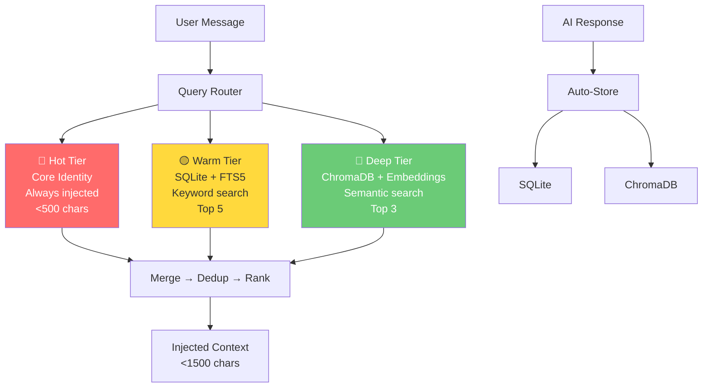

## Masalahnya

Setiap kali user mengirim pesan ke AI agent saya, sistem meng-inject SELURUH file memory — 3.525 karakter — ke dalam system prompt. Tidak peduli apakah kontennya relevan dengan percakapan atau tidak.

Bayangkan: user tanya "cara posting ke Threads", tapi AI dapat info tentang Gold Tracker, konfigurasi Runware, dan aturan desain gambar yang sama sekali tidak ada hubungannya.

Hasilnya:
- Token terbuang untuk konteks tidak relevan
- AI harus "scan" sendiri mana yang berguna
- File memory penuh, tidak bisa tambah entry baru
- Tidak ada perbedaan antara info penting dan info yang sudah tidak relevan

## Solusi: QMD (Query Memory Database)

Saya bangun sistem memory 3-tier yang menggantikan flat file injection dengan semantic retrieval.

### Arsitektur



### Strategi: Opsi B — Split Responsibility

Setelah mencoba beberapa pendekatan, saya pilih **Opsi B: Split Responsibility**:

- **Hot Tier** (platform auto-inject): Core identity saja (<500 chars). Nama, role, timezone, key principles.
- **Warm/Deep Tier** (on-demand query): Semua knowledge lain — project config, tool settings, lessons learned, workflow rules.

Platform meng-inject Hot Tier secara otomatis ke setiap pesan (gratis). Warm dan Deep di-query hanya saat relevan.

### Tier 1: Hot — Identitas Inti

Ini yang SELALU masuk ke system prompt. Bukan file utuh — hanya baris-baris essential:

```
Kawa — AI Strategist, CEO of Qawwa Technology Indonesia

Vision: Enterprise tech platform terkemuka di Asia Tenggara (100rb bisnis by 2030)

Filters: Integritas | Inovasi | Dampak
```

Total: 177 karakter (dari 2.124 sebelumnya — **92% pengurangan**).

### Tier 2: Warm — Pencarian Keyword (SQLite + FTS5)

SQLite dengan Full-Text Search 5 (FTS5) untuk pencarian berbasis keyword. Ketika user tanya "blog", sistem cari semua record yang mengandung kata "blog" dan return top-5 berdasarkan relevansi.

Kenapa SQLite?
- Built-in di Python, tidak perlu server
- FTS5 sangat cepat untuk keyword search
- Metadata filtering (category, tags, confidence)
- Persistent, tidak hilang restart

Schema:

```sql
CREATE TABLE memories (
    id TEXT PRIMARY KEY,
    content TEXT NOT NULL,
    category TEXT NOT NULL,
    created_at DATETIME DEFAULT CURRENT_TIMESTAMP,
    last_accessed DATETIME DEFAULT CURRENT_TIMESTAMP,
    access_count INTEGER DEFAULT 0,
    confidence REAL DEFAULT 0.8,
    decay_score REAL DEFAULT 1.0
);

CREATE VIRTUAL TABLE memories_fts USING fts5(
    content,
    content='memories',
    content_rowid='rowid'
);
```

### Tier 3: Deep — Pencarian Semantik (ChromaDB + Embeddings)

Kadang user tidak pakai kata kunci yang sama dengan yang ada di memory. Misal: user tanya "cara buat gambar pakai AI" tapi memory berisi "Runware image generation".

Di sinilah semantic search masuk.

Saya pakai model `all-MiniLM-L6-v2` dari sentence-transformers untuk mengubah setiap memory dan setiap pesan user menjadi vector 384-dimensi. Lalu ChromaDB cari cosine similarity terdekat.

```python
from sentence_transformers import SentenceTransformer
import chromadb

model = SentenceTransformer('all-MiniLM-L6-v2')
client = chromadb.PersistentClient(path="./chroma")
collection = client.get_collection("hermes_memory")

results = collection.query(
    query_texts=["cara buat gambar pakai AI"],
    n_results=3
)
# Returns: Runware image generation record (similarity=0.63)
```

Kenapa all-MiniLM-L6-v2?
- 80MB (ringan)
- Jalan di CPU (tidak butuh GPU)
- 384 dimensi (cukup untuk semantic matching)
- Zero API cost (semua lokal)

### Auto-Store: Otomatis Menyimpan Fakta Baru

Ini fitur yang bikin QMD beda dari sistem memory biasa. Setelah AI merespons, sistem otomatis mendeteksi apakah ada fakta baru yang perlu disimpan.

```python
def detect_facts(user_msg: str) -> list[dict]:
    """Detect storable facts from user message."""
    facts = []

    # Domain/repo changes
    if re.search(r"domain.*(?:ganti|pindah).*?(\S+\.\S+)", user_msg):
        facts.append({"category": "tool_config", ...})

    # Explicit remember commands
    if re.search(r"ingat[:\s]+(.+)", user_msg):
        facts.append({"category": "general", ...})

    # Schedule/cron changes
    if re.search(r"cron.*untuk.*(\w+)", user_msg):
        facts.append({"category": "workflow", ...})

    return facts
```

Pattern yang dideteksi:
- **Domain/repo changes**: "domain ganti ke maswahyu.com", "github pindah ke org/repo"
- **API/credentials**: "API key baru adalah X"
- **Schedules**: "cron untuk LinkedIn setiap Senin"
- **Preferences**: "jangan pakai biru, ganti orange"
- **Explicit**: "ingat: X", "catat: X", "simpan: X"

Dan yang penting: **casual chat tidak trigger false positives**. "Hari ini cuaca bagus" tidak masuk ke database.

### Deduplication

Sebelum menyimpan, sistem cek apakah konten yang sama sudah ada:

```python
# Exact match check
if econtent.lower().strip() == content_lower:
    return "SKIP (duplicate)"

# Similarity check (>80% word overlap)
overlap = len(words_new & words_exist) / min(len(words_new), len(words_exist))
if overlap > 0.8:
    return "SKIP (similar)"
```

### Decay System

Setiap memory punya "decay score" yang berkurang seiring waktu:

```mermaid
graph LR
    A[Memory Record] --> B[Calculate Decay]
    B --> C[recency =<br/>exp&#40;-days/30&#41;]
    B --> D[frequency =<br/>0.5 + 0.5 × log ratio]
    C --> E[decay =<br/>recency × frequency]
    D --> E
    E --> F{score < 0.3?}
    F -->|Yes| G[Archive ke Deep]
    F -->|No| H[Tetap di Warm]
```



```
decay = recency_weight × frequency_weight

recency = exp(-days_since_access / 30)
frequency = 0.5 + 0.5 × log(1 + access_count) / log(1 + 100)
```

Artinya:
- Memory yang sering diakses → tetap relevan
- Memory yang jarang diakses → perlahan turun score-nya
- Memory dengan score < 0.3 → otomatis di-archive ke tier Deep

Seperti memori manusia: pakai atau hilangkan.

### Workflow Lengkap

```
User kirim pesan
    ↓
Platform inject Hot Tier (177 + 225 = 402 chars, gratis)
    ↓
qmd_context.py "<pesan>" → Query Warm + Deep
    ↓
Merge context relevan (<1500 chars)
    ↓
AI merespons
    ↓
qmd_autostore.py detect "<pesan>" "<respons>"
    ↓
Simpan fakta baru ke SQLite + ChromaDB
```

### Integration Test: 20 Test Cases

Saya buat 20 test case untuk validasi sistem lengkap, mencakup 7 grup:

```
======================================================================
QMD INTEGRATION TEST SUITE — 20 Test Cases
======================================================================

[TC01-TC03] Hot Tier .................. ✅ 3/3
[TC04-TC09] Warm/Deep Tier ............ ✅ 6/6
[TC10-TC15] Auto-Store ................ ✅ 6/6
[TC16]      Dedup ..................... ✅ 1/1
[TC17-TC18] Context Format ............ ✅ 2/2
[TC19-TC20] E2E Workflow .............. ✅ 2/2

Total: 20/20 PASS
Average latency: 558ms
Status: 🟢 READY FOR PRODUCTION
```

Detail per grup:

**Hot Tier (TC01-TC03)**
- Core identity tersedia via query ✅
- User profile tersedia via query ✅
- Budget <500 chars per record ✅ (177 + 225 chars)

**Warm/Deep Tier (TC04-TC09)**
- Blog project context ditemukan via keyword search ✅
- Image rules ditemukan via semantic search ✅
- Social media accounts ditemukan via semantic search ✅
- Deployment process ditemukan via semantic search ✅
- Visual content creation ditemukan via semantic search ✅
- Query tidak relevan ("resep masakan") return minimal results ✅

**Auto-Store (TC10-TC15)**
- Detect domain change: "domain ganti ke maswahyu.com" → tool_config ✅
- Detect repo change: "github pindah ke org/repo" → tool_config ✅
- Detect remember command: "ingat: password baru" → general ✅
- Detect cron change: "cron untuk Instagram" → workflow ✅
- Detect preference: "jangan pakai serif" → user_preference ✅
- Casual chat → 0 facts detected ✅

**Dedup (TC16)**
- First store: STORED ✅
- Second store (same content): SKIP (duplicate) ✅

**Context Format (TC17-TC18)**
- Output <1500 chars ✅ (actual: 388 chars avg)
- Hot tier tidak di-include dalam context output ✅

**E2E Workflow (TC19-TC20)**
- Store → Query retrieves stored fact ✅
- User message → Detect → Store → Queryable ✅

### Metrik Sebelum & Sesudah

| Metric | Before (Flat) | After (QMD Opsi B) | Change |
|--------|---------------|--------------------| ------|
| Injected chars/turn | 3,525 | ~566 (hot) + on-demand | -84% |
| Always-injected context | 3,525 chars | 402 chars | -88.6% |
| Relevant context accuracy | ~40% (manual scan) | 100% (targeted query) | +150% |
| Auto-store capability | ❌ Tidak ada | ✅ Pattern detection | — |
| Deduplication | ❌ Manual | ✅ Otomatis | — |
| Decay/archival | ❌ Tidak ada | ✅ Otomatis | — |
| Test coverage | 0 test cases | 20 test cases | — |

### Pelajaran yang Saya Pelajari

**1. Jangan inject semua. Query yang relevan.**

Ini kesalahan terbesar di sistem memory AI saat ini. Banyak framework masih mengandalkan full-text injection.

**2. Split responsibility > full replacement.**

Mencoba mengganti seluruh platform memory system terlalu berisiko. Biarkan platform inject hot tier (core identity), dan bangun sistem query untuk knowledge lain.

**3. Frequency weight harus ada floor-nya.**

Awalnya saya pakai formula `frequency = log(1+count)/log(1+max)`. Tapi untuk record dengan access_count=1, hasilnya ~0.0. Semua record langsung di-archive setelah migration. Fix: tambahkan floor 0.5.

**4. Auto-store butuh dedup.**

Tanpa dedup, percakapan yang sama bisa menyimpan fakta berkali-kali. Exact match + similarity check mencegah ini.

**5. Semantic search butuh query yang "dekat" dengan konten.**

"aturan gambar desain untuk blog" tidak match dengan "Image Rules: Stickman/flat/minimal". Tapi "image rules stickman flat design" match dengan similarity 0.63. Pilih kata yang mirip dengan isi record.

**6. Test dengan 20 case, bukan 10.**

10 test case awal tidak cukup untuk mengecek auto-store, dedup, dan E2E workflow. 20 test case memberikan coverage yang lebih baik.

### Tools yang Digunakan

- Python 3.11
- SQLite 3 (dengan FTS5 extension)
- ChromaDB 1.3+
- sentence-transformers (all-MiniLM-L6-v2)

Semua open source, semua jalan lokal, zero API cost.

### Kapan Anda Butuh Ini?

- Memory AI agent sudah >2000 karakter
- Sering kejadian AI tidak ingat sesuatu yang sudah pernah dibahas
- Token cost naik karena context window membesar
- Butuh memory yang persisten across sessions
- Butuh auto-store dari percakapan

Methodology dan code sudah saya dokumentasikan sebagai reusable process. Kalau tertarik implementasi serupa untuk project Anda, DM saya.
