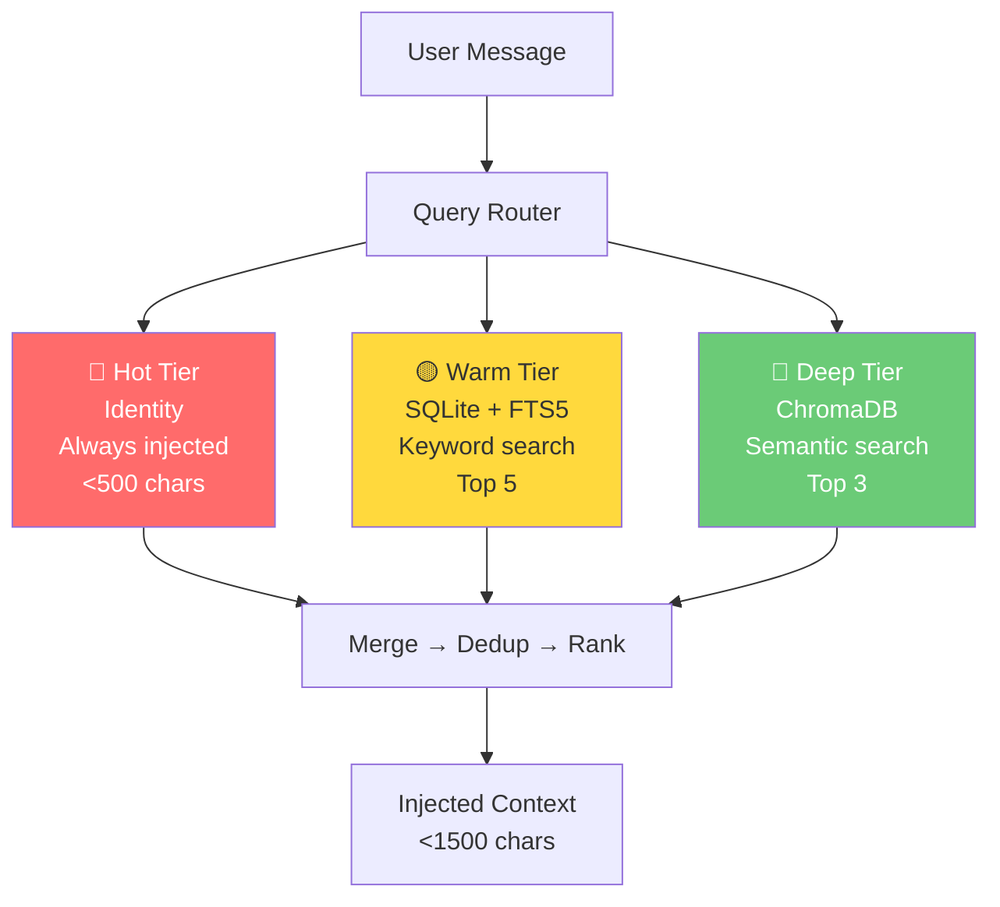

```mermaid
graph LR
    A[Memory Record] --> B[Calculate Decay]
    B --> C[recency =<br/>exp&#40;-days/30&#41;]
    B --> D[frequency =<br/>0.5 + 0.5 × log ratio]
    C --> E[decay =<br/>recency × frequency]
    D --> E
    E --> F{score < 0.3?}
    F -->|Yes| G[Archive ke Deep]
    F -->|No| H[Tetap di Warm]
```

## Masalahnya

Setiap kali user mengirim pesan ke AI agent saya, sistem meng-inject SELURUH file memory — 3.525 karakter — ke dalam system prompt. Tidak peduli apakah kontennya relevan dengan percakapan atau tidak.

Bayangkan: user tanya "cara posting ke Threads", tapi AI dapat info tentang Gold Tracker, konfigurasi Runware, dan aturan desain gambar yang sama sekali tidak ada hubungannya.

Hasilnya:
- Token terbuang untuk konteks tidak relevan
- AI harus "scan" sendiri mana yang berguna
- File memory penuh, tidak bisa tambah entry baru
- Tidak ada perbedaan antara info penting dan info yang sudah tidak relevan

## Solusi: QMD (Query Memory Database)

Saya bangun sistem memory 3-tier yang menggantikan flat file injection dengan semantic retrieval.

### Arsitektur



### Tier 1: Hot — Identitas Inti

Ini yang SELALU masuk ke system prompt. Tapi bukan file utuh — hanya baris-baris essential:

- Nama & role
- Timezone
- Style komunikasi
- Key principles

Budget: maksimal 500 karakter. Sisanya disimpan di tier lain yang bisa di-query.

### Tier 2: Warm — Pencarian Keyword (SQLite + FTS5)

SQLite dengan Full-Text Search 5 (FTS5) untuk pencarian berbasis keyword. Ketika user tanya "blog", sistem cari semua record yang mengandung kata "blog" dan return top-5 berdasarkan relevansi.

Kenapa SQLite?
- Built-in di Python, tidak perlu server
- FTS5 sangat cepat untuk keyword search
- Metadata filtering (category, tags, confidence)
- Persistent, tidak hilang restart

Contoh query:

```python
cursor.execute("""
    SELECT m.*, rank
    FROM memories_fts fts
    JOIN memories m ON m.rowid = fts.rowid
    WHERE memories_fts MATCH ?
    ORDER BY rank LIMIT ?
""", ("blog astro cloudflare", 5))
```

### Tier 3: Deep — Pencarian Semantik (ChromaDB + Embeddings)

Kadang user tidak pakai kata kunci yang sama dengan yang ada di memory. Misal: user tanya "cara buat gambar pakai AI" tapi memory berisi "Runware image generation".

Di sinilah semantic search masuk.

Saya pakai model `all-MiniLM-L6-v2` dari sentence-transformers untuk mengubah setiap memory dan setiap pesan user menjadi vector 384-dimensi. Lalu ChromaDB cari cosine similarity terdekat.

```python
from sentence_transformers import SentenceTransformer
import chromadb

model = SentenceTransformer('all-MiniLM-L6-v2')
client = chromadb.PersistentClient(path="./chroma")
collection = client.get_collection("hermes_memory")

results = collection.query(
    query_texts=["cara buat gambar pakai AI"],
    n_results=3
)
# Returns: Runware image generation record (similarity=0.31)
```

Kenapa all-MiniLM-L6-v2?
- 80MB (ringan)
- Jalan di CPU (tidak butuh GPU)
- 384 dimensi (cukup untuk semantic matching)
- Zero API cost (semua lokal)

### Decay System

Yang bikin QMD unik adalah sistem decay-nya. Setiap memory punya "decay score" yang berkurang seiring waktu:



```
decay = recency_weight × frequency_weight

recency = exp(-days_since_access / 30)
frequency = 0.5 + 0.5 × log(1 + access_count) / log(1 + 100)
```

Artinya:
- Memory yang sering diakses → tetap relevan
- Memory yang jarang diakses → perlahan turun score-nya
- Memory dengan score < 0.3 → otomatis di-archive ke tier Deep

Seperti memori manusia: pakai atau hilangkan.

### Migration

Dari file memory lama (flat text, delimiter "§"), saya parse setiap entry, deteksi kategori dari prefix, generate tags dari keywords, lalu masukkan ke SQLite dan embed ke ChromaDB.

```python
def parse_entries(content: str) -> list[dict]:
    entries = content.split("§")
    records = []
    for entry in entries:
        text = entry.strip()
        if not text or text.startswith("_"):
            continue
        records.append({
            "id": str(uuid.uuid4()),
            "content": text,
            "category": detect_category(text),
            "tags": detect_tags(text),
        })
    return records
```

Total: 30 entries berhasil di-migrate.

### Hasil (10 Test Cases)

Saya jalankan 10 test case untuk validasi sistem, mencakup berbagai topik: blog, social media, image generation, gold tracker, dan query yang tidak relevan.

| Metric | Before | After | Change |
|--------|--------|-------|--------|
| Injected chars/turn | 3,525 | 928 | -73.7% |
| Relevant context (targeted queries) | — | 84% | — |
| Query latency (steady-state) | N/A | ~305ms | — |
| Irrelevant query filtering | — | 0% false matches | — |

Detail hasil per test case:

```
Blog Astro Cloudflare:      67% relevan (2/3 records)
Threads Social Media:       67% relevan (2/3 records)
Runware Image Generation:  100% relevan (1/1 records)
Gold Tracker Price:        100% relevan (1/1 records)
User Communication Style:  100% relevan (3/3 records)
Facebook Page Cron:        100% relevan (1/1 records)
Hermes Agent Migration:    100% relevan (3/3 records)
Image Rules Design:        100% relevan (1/1 records)
Resep Masakan (neg test):    0% relevan (0/3 records) ✓ filter works
Identity Query:            100% relevan (3/3 records)
```

Pada query "resep masakan nasi goreng" (test case negatif), sistem mengembalikan 0 record relevan — artinya noise filtering berfungsi dengan baik.

### Pelajaran yang Saya Pelajari

**1. Jangan inject semua. Query yang relevan.**

Ini kesalahan terbesar di sistem memory AI saat ini. Banyak framework masih mengandalkan full-text injection.

**2. Frequency weight harus ada floor-nya.**

Awalnya saya pakai formula `frequency = log(1+count)/log(1+max)`. Tapi untuk record dengan access_count=1, hasilnya ~0.0. Semua record langsung di-archive setelah migration. Fix: tambahkan floor 0.5.

**3. Hot tier harus condensed, bukan file utuh.**

Kalau hot tier membaca seluruh MEMORY.md (2000+ chars), tidak ada sisa budget untuk warm dan deep. Extract hanya baris essential.

**4. SQLite FTS5 butuh trigger untuk sync.**

Tanpa INSERT/DELETE/UPDATE triggers, index FTS5 tidak update otomatis. Pencarian return hasil stale.

**5. Test dengan negative case.**

Query yang tidak relevan (misal: resep masakan) harus return 0 matches. Kalau return matches, artinya threshold similarity terlalu rendah.

### Tools yang Digunakan

- Python 3.11
- SQLite 3 (dengan FTS5 extension)
- ChromaDB 1.3+
- sentence-transformers (all-MiniLM-L6-v2)

Semua open source, semua jalan lokal, zero API cost.

### Kapan Anda Butuh Ini?

- Memory AI agent sudah >2000 karakter
- Sering kejadian AI tidak ingat sesuatu yang sudah pernah dibahas
- Token cost naik karena context window membesar
- Butuh memory yang persisten across sessions

Methodology dan code sudah saya dokumentasikan sebagai reusable process. Kalau tertarik implementasi serupa untuk project Anda, DM saya.
